.. ==================================================
.. FOR YOUR INFORMATION
.. --------------------------------------------------
.. -*- coding: utf-8 -*- with BOM.

.. include:: ../Includes.txt

What does it do?
================
The TYPO3 Layer Slider extension connects the TYPO3 backend with the Layer Slider. Creating new slides thus becomes child's play. For each slide there are a lot of options available to the slide to make it unique.

For each slide also new layers (pro version only) can be created with text or images. On the "Positioning Stage", the individual layers are placed on the slider and with the mouse you can dragthe item to the desired position.

The background images for the slides as well as for the individual layers (Cut, smaller images, etc.) can easily select and uploaded within the TYPO3 Filebrowser.

The "Transition Gallery" (pro version only) offers a variety of transitions, whether 2D or 3D. Thus, the transitions can be designed by a slide to the next even more impressive.

The TYPO3 Layer Slider extension based on the Layer Slider by kreatura media offers a high level of comfort for those who do not want to turn the slider with HTML. To maintain the slider there is a own backend mmodule. To use a Layer Slider on one side only the Layer Slider Plugin has to be placed. In a selection box can be selected from all sliders.

In this free version you have this features:

- Create/edit sliders as many you want
- Create/edit slides as many you want
- make all slider/slide options as in the full version

With the full version you get this features:
- Create/edit layers for slides as many you need
- Use the transition gallery for real cool effects!

Important!
==========

You get the full version under http://www.rutschmann.biz/en/extensions/typo3-layerslider/order/ . For this and for the full version you have to buy the jquery layerslider plugin at codecanyon (http://codecanyon.net/item/layerslider-responsive-jquery-slider-plugin/922100). The jquery layerslider plugin is not bundled with this or the full version!

Screenshots
===========

Slider Backend Module after installation
----------------------------------------
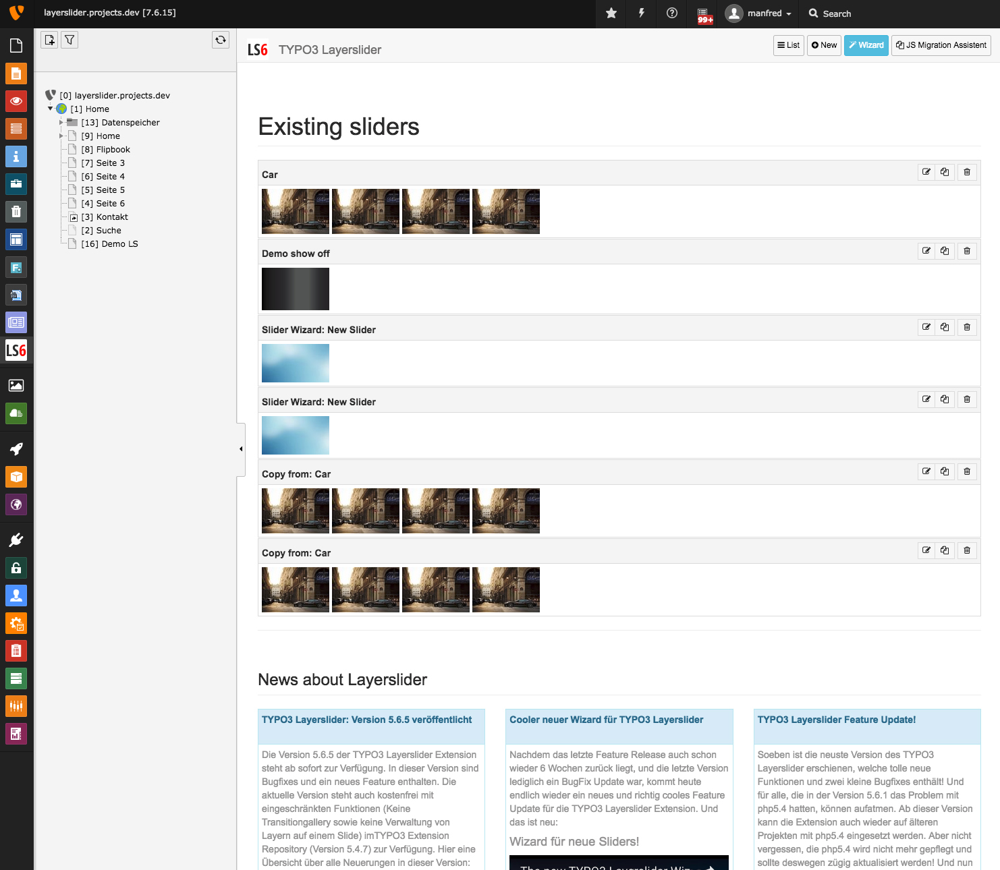

    	Starting Layerslider Backend Module after installation. You can use the JS migration assistant to integrate the jQuery layerslider sources. Then you can use the Slider wizard to create easy new slides.

JS Migration Wizard
-------------------
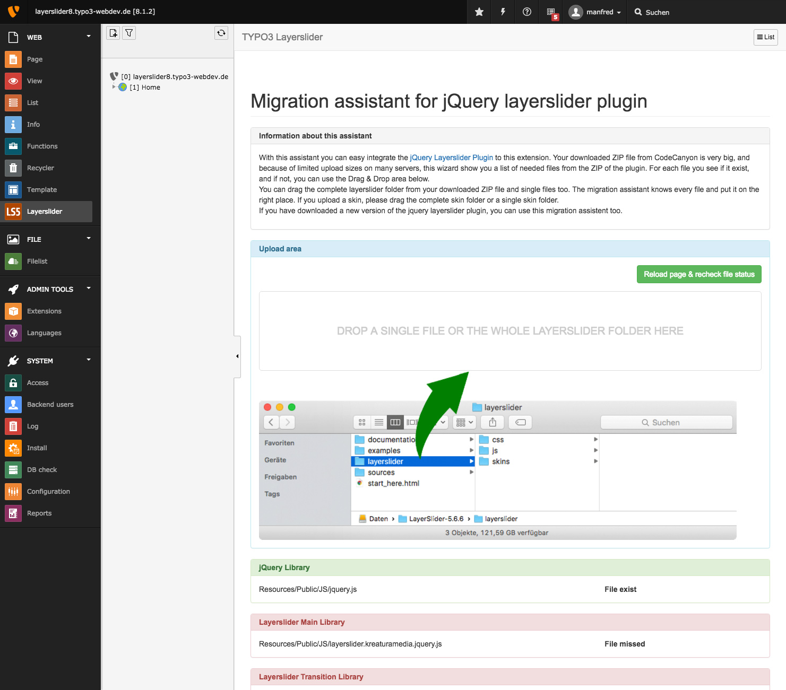

        In this new version you don't have to integrate the jQuery Layerslider Plugin by hand before yoi install this extension. Just install the extension, open the Layerslider backend module and call the JS Migration assistant. Unzip your purchased jQuery layerslider plugin and drop the included layerslider folder to the upload area. The migration asisstant includes all needed files for you.

Layerslider Slider Wizard Step 1
--------------------------------
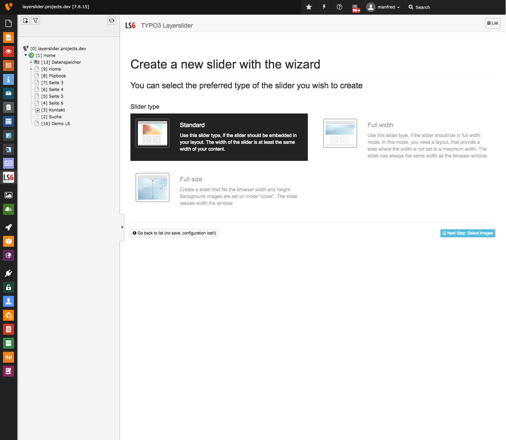

        You can create very easy new sliders. Just start the Slider wizard. In this first step you can choose between a standard slider or a fullwidth.

Layerslider Slider Wizard Step 2
--------------------------------
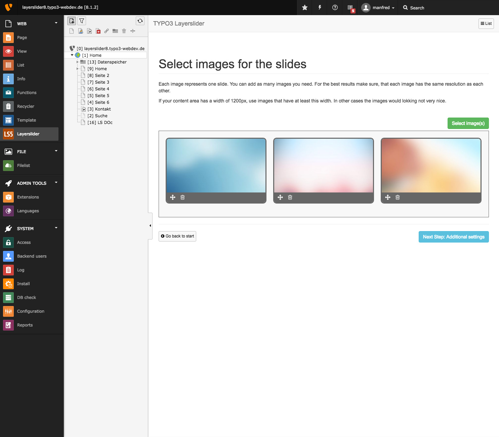

        Just select some files from the TYPO3 Filebrowser Element. You can upload new images there too. Rearrange the image order or remove not needed ones.

Layerslider Slider Wizard Step 3
--------------------------------
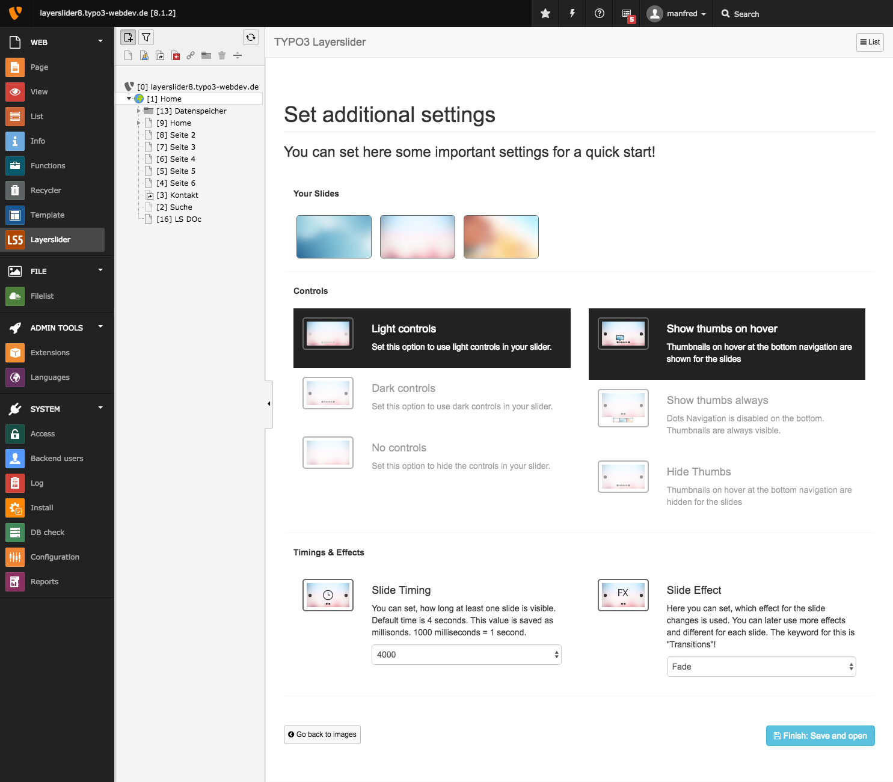

        In the last step you can set different options to your new slider, like controls, colors, sliding effect and slide duration. Save this and your new slider gets to be created.

Edit a slider
-------------
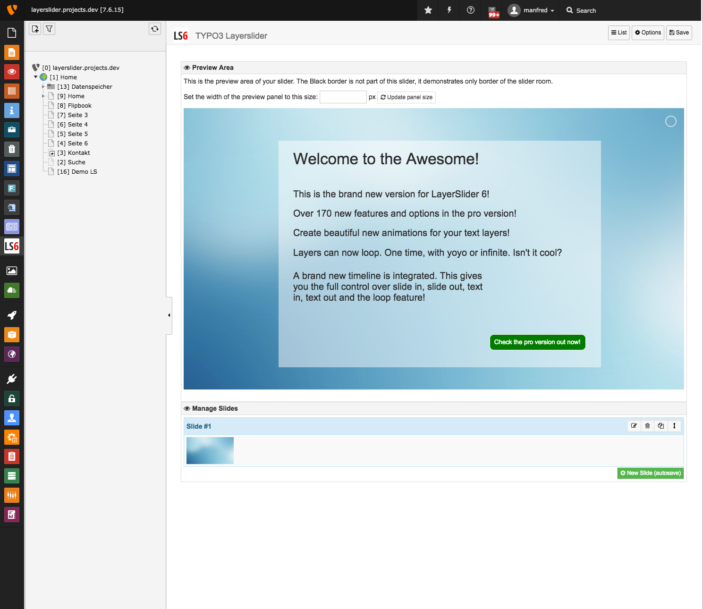

        When you edit a slider, you can see the full preview of all slides and layers (layers only in pro version) in the backend. You can manage slides, create new one, rearrage the order or delete them. Each slide can be hidden or timed with start/stop times. The preview area can be adjusted in the with, to simulate your frontend width.

Slide basic options
-------------------
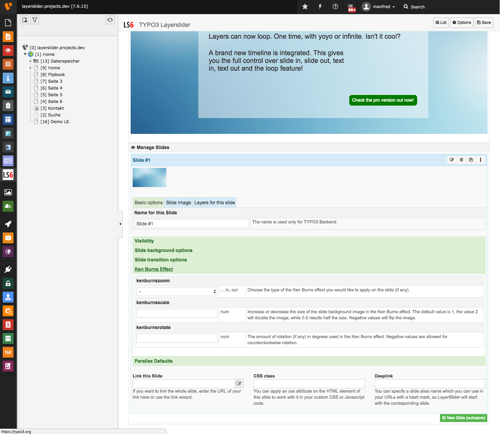

Slide image
-----------
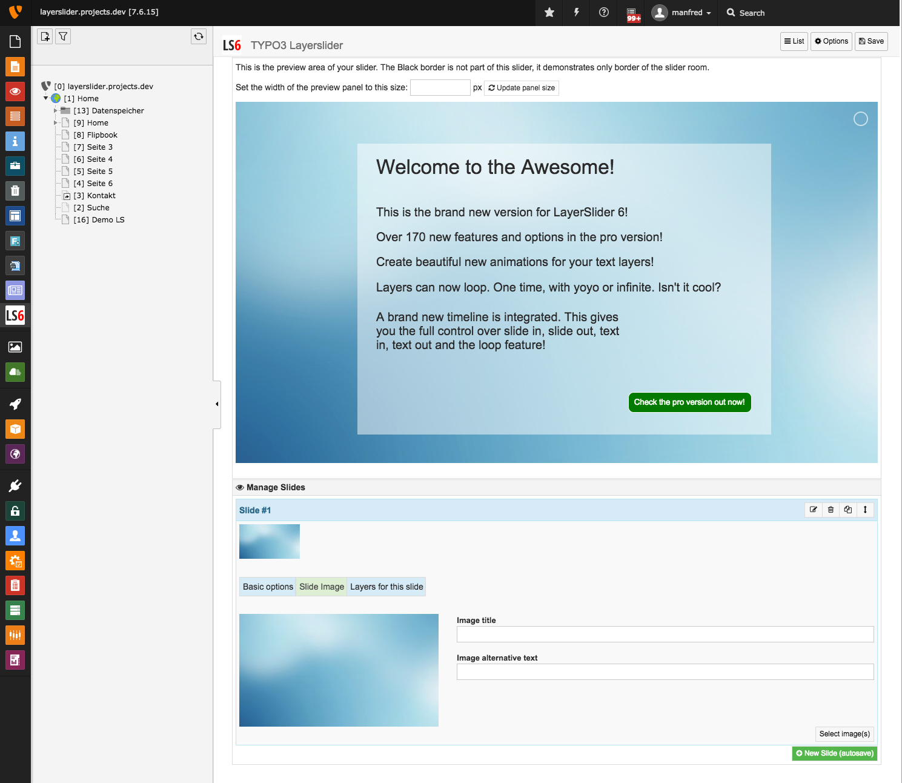

Slide layer (Pro version only!)
-------------------------------
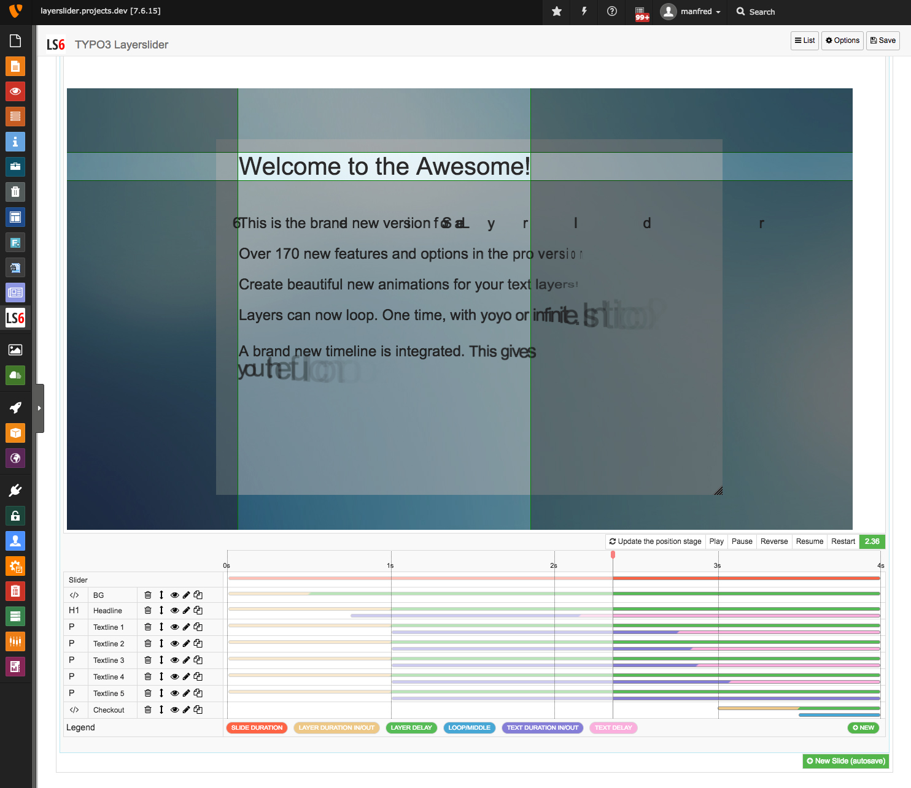

	    Each slide can have multiple layers, and you can manage them with order and start/stop times.
	    Each layer can be placed on the positioning stage. You can arrange them with object snap or a defined pixel grip.
	    The timeline makes the effect timings visible so you can easy see, which layer wich times had. For each layer, you can set many in and out timings, effects and transitions.

Slider plugin
-------------
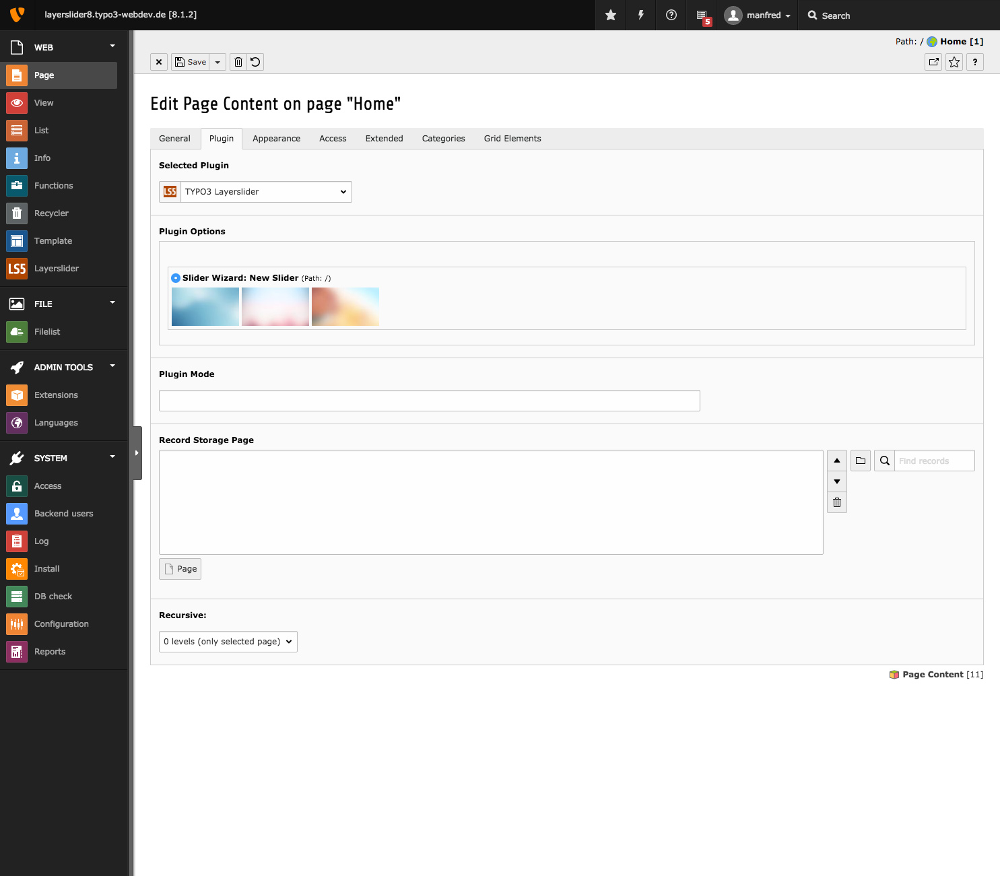

        When you finished your slider in the Layerslider backend module, just open a page and place the Layerslider plugin. Select one slider from the list and it comes up in the frontend!

Some demo videos
----------------
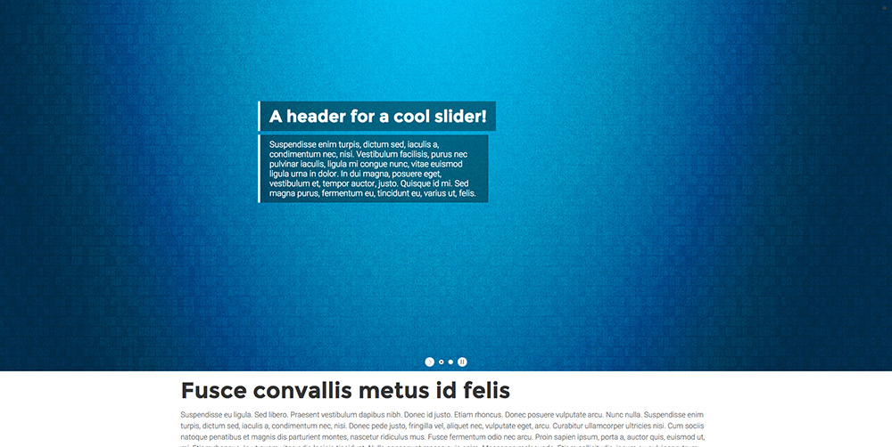

        New Demo video: Create a fullwidth slider https://www.youtube.com/watch?v=jKeKUyq2Gpg&feature=youtu.be

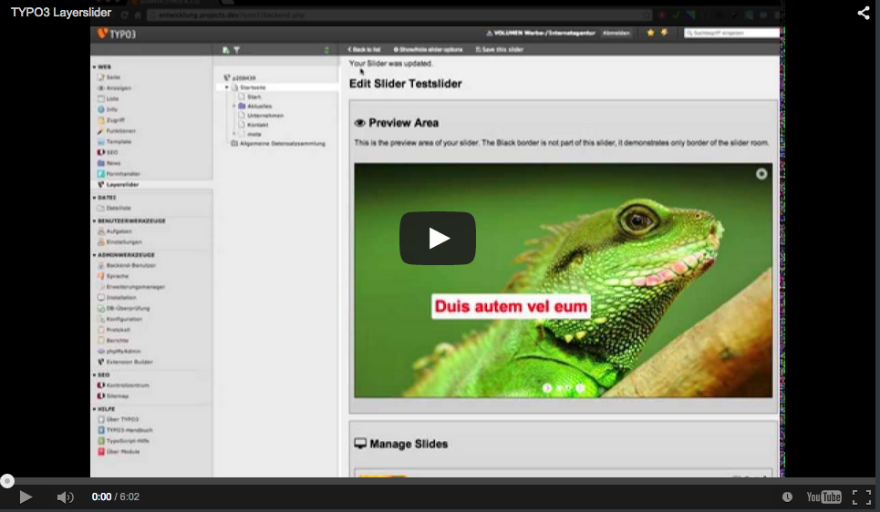

        Old video: Create new slider https://www.youtube.com/watch?v=ARQzC5easG8

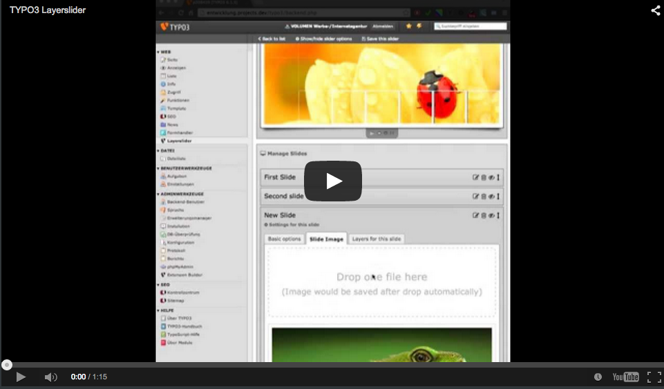

        Old video: Edit a slider https://www.youtube.com/watch?v=URyfySJUa3s